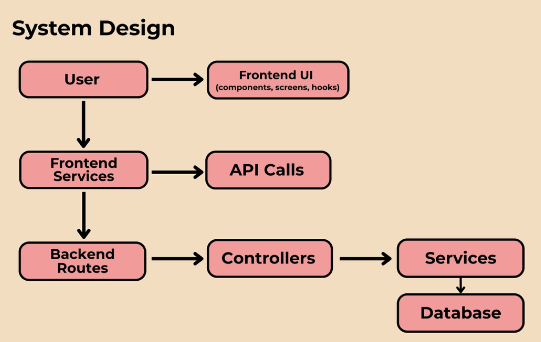
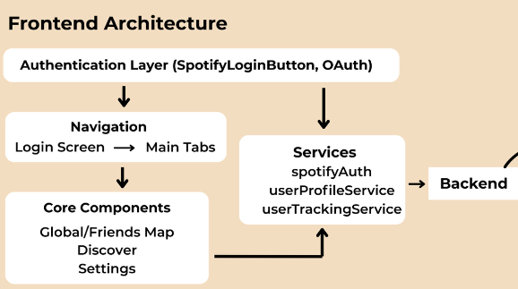
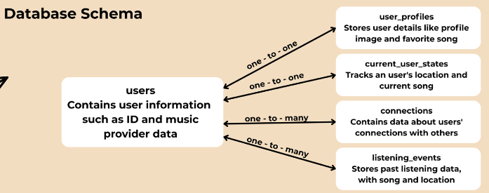

# Introduction

As of Q3 2023, there were 713.4 million music streaming subscribers worldwide[^1]. As of Q3 2024, there were 263 million Spotify premium subscribers worldwide[^2]. We intend to capture the enthusiasts in Spotify's market and potentially a portion of enthusiastic non-Spotify users. We envision businesses such as cafes, gyms, and bars that want to use our application to integrate music into their customer experience and marketing scheme. Furthermore, stakeholders in the music industry (artists, labels, producers, etc.) who wish to grow their audience may want to join our platform.

There are a few applications that emphasize music discovery. Most influential, [Airbuds Widget](https://apps.apple.com/us/app/airbuds-widget/id1638906106) shows you what your friends on the app are currently listening to on the homescreen. Another app, [Soundmap](https://apps.apple.com/us/app/soundmap-find-your-songs/id6476420863), puts collectible songs on a map, allowing users to collect them Pokémon Go style and trade with other users. Lastly, [Fan Label](https://fanlabel.com/) lets users construct fantasy record labels where they can predict the popularity of new artists and music, earning points in the process from their real-world performance.

In our minds, Crescendo is, at its core, a combination of these three apps with plenty of additional features.

User-based collaborative filtering identifies users with similar preferences and suggests items they’ve liked. While methods like cosine similarity are effective for identifying similar users, they struggle with sparsity (low overlap in ratings) and the cold-start problem (new users without sufficient data)[^3]. Graph Neural Networks (GNNs) address these challenges by utilizing user and item relationships, enabling recommendations even with minimal data by incorporating information from users’ networks[^4].

The deprecation of Spotify's relevant API impacted our consideration of audio features for comparing song similarities. Although alternatives like RaccoBeats were identified, they could violate Spotify TOS. Without access to audio features, we can rely on comparing listening histories to recommend songs or artists based on shared preferences.

In terms of location privacy, the review of snapshot and continuous location-based services (LBS) informed our app’s hybrid approach. Techniques like dummy locations and cloaking offer effective privacy-preserving solutions by obfuscating precise user locations[^5]. While precise location data will be stored on our server, these techniques will be applied on the front-end to protect users’ privacy in public-facing interactions.

Ultimately, Crescendo is a social music discovery app that enables users to explore music around them in real-time, engage with nearby listeners, and participate in community-driven events while offering promotional opportunities to businesses and stakeholders in the music industry through music trends.

# Methodology

Crescendo uses a full-stack system with React Native (via Expo) for the front end, Express with Node.js for the back end, and Supabase/PostgreSQL for managing the database. We chose these tools to make the app run smoothly on iOS and Android. We aimed to build a real-time social music app that updates as people move and listen to music while keeping user privacy and control at the center.

 

Users interact with the app through a clean and simple frontend UI, which includes screens like Discover, Global Map, Messages, and Settings. The frontend sends requests through services (like SpotifyAuth, userProfileService, and userTrackingService), which then call backend API routes to get or send data.

After a user logs in through Spotify OAuth, their current song and location are tracked in the background and sent to the backend. The backend has controllers that manage these requests and services that talk to the database to update or retrieve data. This ensures that the app reflects what users are listening to and where they are in real time.

Our database stores information in a structured way. For example, users and user_profiles keep track of who the user is and what they like, while current_user_states stores their latest song and location. The listening_events table logs past listening history, and connections tracks who users are friends with. This setup lets users easily find nearby listeners, accept friend requests, and see shared music interests.

Since location is a key feature, we use various techniques to keep users safe. Exact GPS locations are stored on the server, but we use a radius and suggestion cards on the frontend so users are not too exposed. People can also control their visibility, such as only showing their location to friends or remaining completely anonymous.

Ultimately, our approach keeps the system organized, smooths real-time updates, and gives users control over their experience, turning everyday music listening into a fun and safe social activity.

# Limitations and Future Work

We are still working on correctly updating our frontend Map Views by tracking database changes associated with location and music changes. We have yet to build the recommendation system for public view, as our intended approach might clash with Spotify’s Developer Policy. We might resort to cosine similarity of listening histories + proximity + mutuality to avoid pulling track audio features and training AI models, which Spotify frowns upon.

On the feature front, we want a separate category for followers and close friends to implement chatting functionality and develop the discover page functionality soon. From a developer perspective, we need to implement testing and add proper security measures beyond Spotify authentication and Expo’s Secure Storage; we are looking into JWT tokens for transmitting user data.

# Ethics Statement

## 1. Possible Futures
### Positive Future:
Crescendo successfully fosters real-time music discovery while fully protecting user privacy. It builds local music communities, promotes emerging artists, and creates meaningful, social connections without compromising safety or consent.

### Negative Future:
Crescendo unintentionally becomes a tool for stalking, harassment, or misuse. Even with privacy measures in place, users can still be deanonymized. Artists could also face spam or manipulation by fake listeners or bot-driven connections.

## 2. Stakeholders
- **Users**: everyday listeners, students, music fans
- **Artists and Creators**: local musicians, DJs, and independent creators
- **Local Communities**: campus groups, neighborhood music scenes
- **Developers**: the team responsible for building and maintaining the app
- **Advertisers/Partners**: any future third parties interested in collaboration
- **Moderation Team**: responsible for enforcing community guidelines and safety
- **Potential Bad Actors**: those who might misuse location data or harass users
- **Legal and Regulatory Bodies**: organizations concerned with data privacy

## 3. Values and Moral Lenses:

### Values:
- **Privacy**: Protect users' precise locations with cloaking and dummy locations.
- **Consent**: Ensure opt-in for visibility, sharing, and access by third parties.
- **Transparency**: Clear policies on data use and user rights, such as the right to delete.
- **Safety**: Provide robust blocking and reporting tools to handle harassment.
- **Community Integrity**: Focus on genuine music sharing over gamification or competition.
- **Accessibility**: Design an intuitive interface that’s easy for diverse users to navigate.

### Moral Lenses:
- **Outcome Lens**:  
  We aim to maximize positive experiences, such as authentic music discovery and community building, and minimize harm, including location misuse and harassment. Ethical success means both enjoyment and safety for users.

- **Process Lens**:  
  Our processes center on user agency: users actively decide how visible they want to be and what data they share. Consent is prioritized at every step, from account creation to daily app use. Implementing features like radius-based visibility ensures respect for individual comfort levels in all interactions.

- **Structure/Justice Lens**:  
  We are committed to equitable outcomes: all users, regardless of background, should have equal control over their presence and safety. No group should have to deal with more risks or harm than others (like marginalized users facing more harassment). Structural tools, such as contextual reporting and strong moderation, aim to uphold justice across the platform.

In designing Crescendo, we prioritized user control, privacy, and real-time social interaction. We authenticated through Spotify to avoid managing sensitive credentials and anchor the app in a widely used music ecosystem. Using Spotify also introduced a significant limitation: users who do not use Spotify are currently excluded from the platform. This limits inclusivity within our app's community. Another key limitation is our reliance on accurate GPS data for proximity-based features; this may exclude users in areas with weak location signals or those unwilling to share location data, potentially narrowing the social aspect of the app. Our current privacy measures (storing unencrypted data on the server) are not foolproof against determined attackers. We acknowledge the challenge of building a truly abuse-proof platform. We recognize that future development must include continuous audits, robust moderation tools, and inclusive design practices to uphold the ethical standards we set out to achieve.

# References

[^1]: Music Business Worldwide. (February 8, 2024). Number of music streaming subscribers worldwide from the 1st half of 2019 to 3rd quarter 2023 (in millions) [Graph]. In Statista. Retrieved April 29, 2025, from https://www.statista.com/statistics/669113/number-music-streaming-subscribers/

[^2]: Spotify. (February 4, 2025). Number of Spotify premium subscribers worldwide from 1st quarter 2015 to 4th quarter of 2024 (in millions) [Graph]. In Statista. Retrieved April 29, 2025, from https://www.statista.com/statistics/244995/number-of-paying-spotify-subscribers/

[^3]: Pinela, C. (2018, March 31). Recommender Systems — User-Based and Item-Based Collaborative Filtering. Medium. https://medium.com/@cfpinela/recommender-systems-user-based-and-item-based-collaborative-filtering-5d5f375a127f

[^4]: Wu, S., Sun, F., Zhang, W., Xie, X., & Cui, B. (2022). Graph neural networks in recommender systems: A survey. *ACM Computing Surveys*, 55(5), Article 97. https://doi.org/10.1145/3535101

[^5]: Jiang, H., Li, J., Zhao, P., Zeng, F., Xiao, Z., & Iyengar, A. (2021). Location Privacy-preserving mechanisms in location-based services: A comprehensive survey. *ACM Computing Surveys*, 54(1), Article 4. https://doi.org/10.1145/3423165

